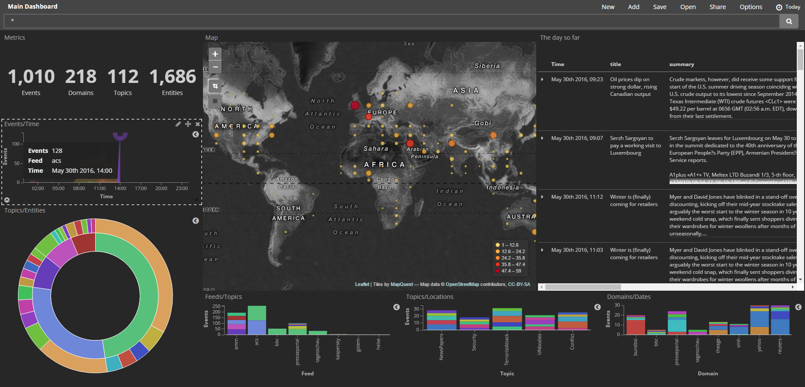
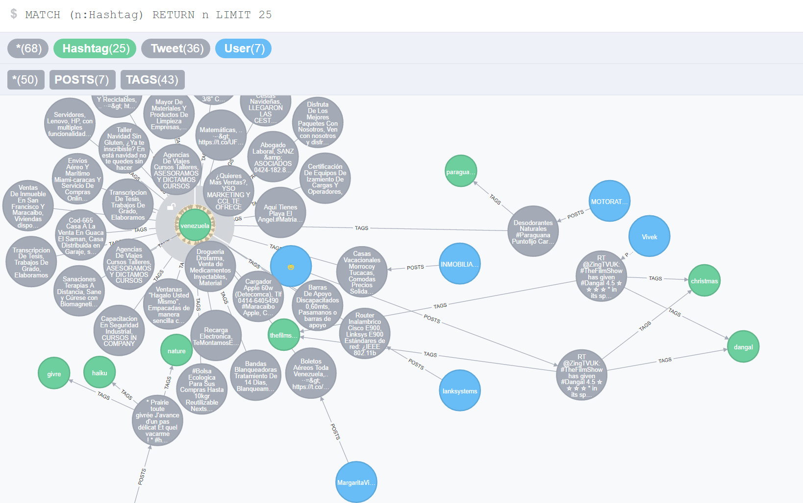
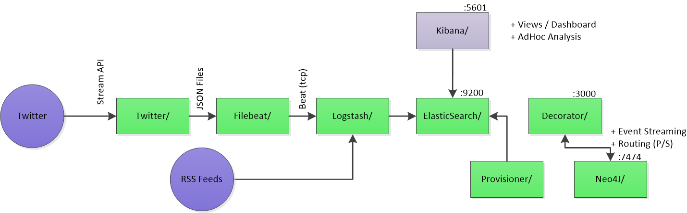

# Cyber security use case for the ELK stack

This comprises Kibana UI and Graph Analysis (using [neo4j](https://neo4j.com/) and [apoc](https://github.com/neo4j-contrib/neo4j-apoc-procedures)).

## Usage

Clone this repository recursively (i.e. including submodules)

```console
git clone --recurse-submodules https://github.com/awesome-inc/docker-elk-cyber.git
```

Start your stack using *docker-compose*:

```console
docker-compose up
```

And then access Kibana UI by hitting [http://localhost:5601](http://localhost:5601) with a web browser.

You should see a dashboard like this



## Graph Analysis

In addition to the standard ELK stack we added a [neo4j](https://neo4j.com/) container including [apoc](https://github.com/neo4j-contrib/neo4j-apoc-procedures).
You can access the neo4j data browser on [http://localhost:7474/](http://localhost:7474/)

You should be able to explore entity relations extracted using OpenNLP on the unstructured article data



Custom actions on neo4j objects can be configured [HATEOAS style](https://en.wikipedia.org/wiki/HATEOAS) using the `decorator` which wraps the neo4j REST Api to provide custom data links.

Browse the current configuration on [http://localhost:3000/api/ai/.config](http://localhost:3000/api/ai/.config).

## Test data

Test data being used for this demo are some News and Security related RSS feeds

- [Europe Media Monitor](http://emm.newsbrief.eu/)
- [Heise Security](http://www.heise.de/security/news/)
- [BSI](https://www.bsi.bund.de/SiteGlobals/Functions/RSSFeed/RSSNewsfeed/RSSNewsfeed.xml)
- [Allianz für Cybersicherheit](https://www.allianz-fuer-cybersicherheit.de/SiteGlobals/Functions/RSSFeed/)
- [Golem](http://www.golem.de/sonstiges/rss.html)
- [BBC](http://www.bbc.com/news/10628494)
- [Bruce Schneier's Blog](https://www.schneier.com/blog)
- ...

And optionally [Twitter](https://www.elastic.co/guide/en/logstash/current/plugins-inputs-twitter.html).
**Note:** Check [Twitter API Status](https://dev.twitter.com/overview/status) for the streaming API.

## Architecture

Latest architecture diagram



